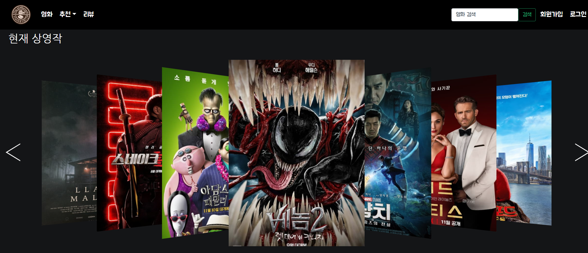
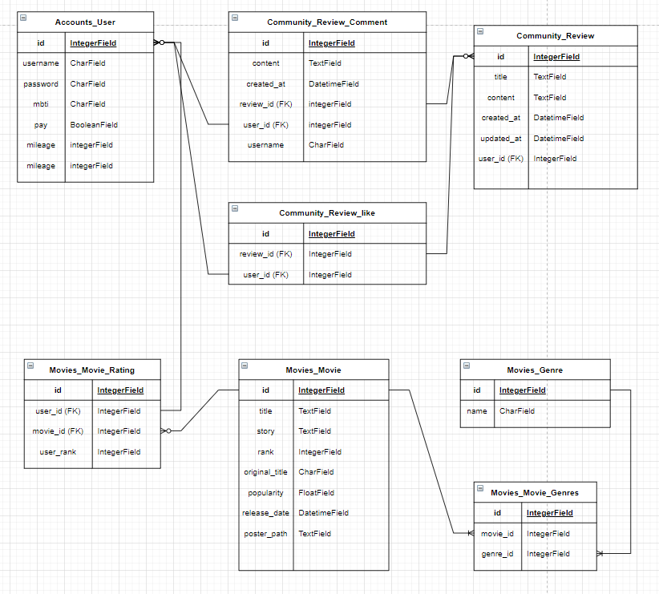
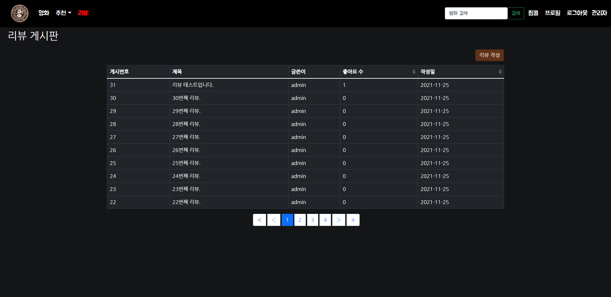
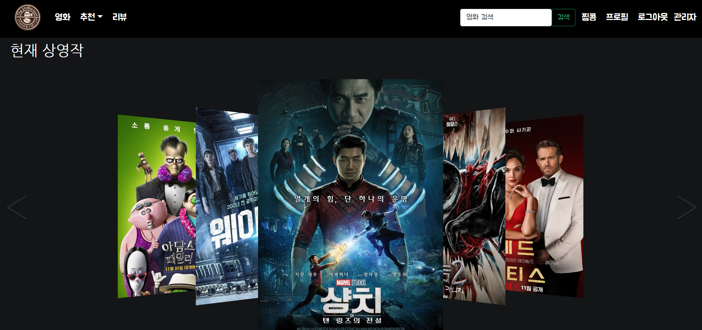
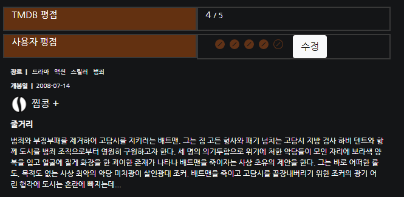
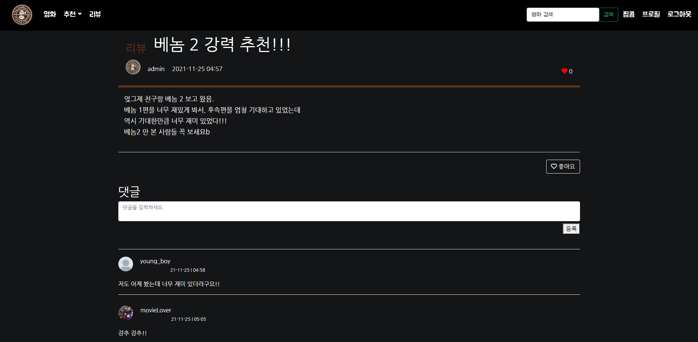
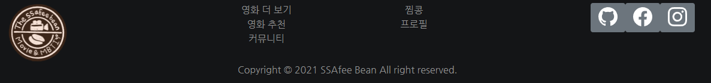

# Final_PJT_SSAfy  Been

## 0. 프로젝트 소개

##### 영화 추천 서비스 

- **프로젝트 기간** : 2021.11.17 ~ 2021.11.25

- 사용자의 성격유형(MBTI)을 기반으로 영화를 추천해주는 서비스입니다. 또한 TMDB 영화 데이터를 바탕으로 사용자가 높은 평점을 준 영화의 장르 중 랜덤으로 추천을 해주는 기능이 구현되어 있습니다. 영화 상세 페이지에서 찜 버튼을 클릭하여 나만의 찜콩 페이지에 좋아하는 영화 리스트를 저장할 수 있습니다. 커뮤니티 기능이 구현되어 있어, 영화에 대해서 사용자 간 리뷰/댓글을 작성할 수 있습니다.




## 1. 팀 소개

##### (1) 팀원 정보

- 손영배
  - back-end
- 장효정
  - front-end

##### (2) 업무 분담

- 손영배
  - Django server & Vue Client
- 장효정
  - Vue Client & Design


## 2. 목표

- 영화 정보 기반 추천 서비스 구성
- 커뮤니티 서비스 구성
- HTML, CSS, JavaScript, Vue.js, Django, REST API, DataBase 등을 활용한 실제 서비스 설계
- 서비스 관리 및 유지보수


## 3. 계획

##### (1) 세부일정

[]()

##### (2) 기본 기능 구현

1. user

   - 관리자
     - 영화 등록 / 수정 / 삭제 - 관리자
     - 유저 관리 권한
   - 사용자
     - 회원가입
     - 로그인
     - 로그아웃

2. movie

   - 현재 상영 영화 정보 제공
   - 영화 detail
     - 영화 정보 - 모든 사용자
     - 평점 등록( 콩 갯수로 등록 / 수정 / 삭제) - 로그인 사용자

3. 영화 추천 알고리즘

   - 장르별 추천 - 모든 사용자

     : 장르별 영화 중 평점 5점 이상 영화에서 랜덤 추천

   - 유저별 추천 - 로그인 사용자

     - 평점 작성 사용자 정보 기반 추천

       : 사용자가 작성한 평점 중 젤  높은 장르에서 랜덤 추천

     - 프리미엄 서비스 사용자 성격유형(MBTI) 정보 기반 추천

       : 성격유형에 맞는 장르에서 추천

4. 리뷰 갤러리

   - 리뷰
     - 조회 및 등록 - 로그인 사용자
     - 수정 및 삭제 - 리뷰 작성자
   - 댓글
     - 조회 및 등록 - 로그인 사용자
     - 삭제 - 댓글 작성자

##### (3) 추가 기능 목표

- user - 사용자
  - 회원 정보 수정
  - 프로필 이미지 추가
- 영화 좋아요 기능
  - 좋아요 버튼을 누르면 유저 프로필(or 별도 페이지)에서 좋아요 버튼을 누른 영화 목록을 볼 수 있음
- 영화 검색기능
- 영화 찜 리스트 등록 - 로그인 사용자
- 리뷰 게시판에서 리뷰 좋아요 기능
- ~~소셜 로그인~~
- ~~카카오페이 연동~~
- ~~위치 기반 가까운 영화관 안내~~

##### (4) 개발환경

- 언어

  1. Python 3.8+

  2. Django 3.X

  3. Node LTS

  4. Vue.js 2.+

- 도구
  1. VSCode
  2. Chrome Browser

- 아키텍처
  1. Django & Vanila JS
  2. Django REST API 서버 & Vue.js


## 4. ERD

[]()


## 5. 프로젝트 과정

#### (1) 2021. 11. 17

<details>
<summary>상세 내용 확인</summary>
<div markdown="1">

##### 1. 오늘의 목표


- 영화데이터 API 수집할 곳 정하기, 조사하기
- Wireframe 만들기
- Django 기본 틀, Model 구축하기
- Community, Movies 앱 CRUD 로직 작성
- 프로젝트 세부 일정 수립하기

##### 2. 오늘의 고민과정

- TMDB API를 통해 영화 데이터 크롤링하기
  - Front 단에서 axios 요청으로 데이터를 통신하는 것 이외에, 기본적으로 Server 내 DB에 일정량의 영화 데이터를 저장하고자 하였다.
  - TMDB API에서 영화 데이터를 불러오고, 이를 SSAfee Bean 프로젝트의 Movie 모델이 가지고 있는 속성과 일치하게끔 가져오려면 어떻게 해야할까? 라는 의문을 가지게 되었다.
  - 구글링을 통해서 `requests` 와 `json` , 그리고 기초적인 Python `for` 문을 사용하면 위 문제를 해결할 수 있음을 알게 되었고, 코드 작성을 통해 우리가 원하는 JSON 형태의 영화 데이터를 얻을 수 있었다.
- Community, Movies 앱의 CRUD 로직 작성
  - 프로젝트 명세에 따라 기본적이면서 핵심적인 CRUD 로직 작성을 하였다.
  - 프로젝트 기술 스택은 Django + Vue.js 이기 때문에 Django에 별도의 Templates 작성을 하지 않았다. 따라서 Django Rest Framework를 사용하여 직렬화(Serializer)된 데이터를 응답(Response)하는 구조로 각각의 CRUD 함수 코드를 작성하였다.
  - Community 앱의 Comment 관련 로직에 대한 고민이 남아있다.
    - 댓글 목록을 불러오는 path와 세부 댓글의 Read/Delete path가 분리되어 있다.
    - 어차피 하나의 리뷰에 여러개의 댓글이 달리는 구조인데, 이 path가 굳이 분리되어 있을 필요가 있을까? (효정과 논의 필요!)

##### 3. 오늘의 결과물

- WireFrame
  []()
- 기본 구조 생성
  .png)
- TMDB API를 활용하여 DB에 저장할 영화 데이터 JSON 파일 생성
  [.png)]()
- community & movies 앱 기본 CRUD 로직 작성
  - Postman을 사용하여 request가 정상적으로 작동하는지 확인
    [.png)]()

##### 4. 오늘의 느낀점

- 장효정
  - 기획 단계가 가장 어렵고 중요하다고 하셨던 교수님 말씀이 이해가 완전 됐다. 기획내용들이 정확하면 개발하는 과정에서 헷갈리는 경우는 확실히 줄 것이라는 생각이 들었다.
  - wireframe을 처음 접하고 그려보면서 대략적인 완성본의 모습을 그린다는 게 생각했던 거보다 어려웠다. 그리는건 쉬운데 아이디어를 정리하고 어떻게 표현할 것인지 정리하는 과정에서 시간을 많이 사용했다.
  - 오늘 프로젝트 첫날인데 내일부터 끝나는 날까지 매일이 걱정보다는 기대가 크다. 물론 구현하려고 했던 게 생각처럼 바로 되지 않는 경우들 때문에 고민의 시간들이 있겠지만 그래도 생각했던 기능들을 다 구현해서 상상 속 페이지가 실제로 완성된 거 보면 엄청 뿌듯하고 기분 좋을 것 같다는 기대감이 든다.
- 손영배
  - 프로젝트 1일차이다. 매주 금요일마다 했던 PJT 경험과 코드를 참고해서 기본적인 구조는 최대한 빠르게 작성하고자 하였다. 명세에 맞는 핵심 기능을 완벽하게 구현하고 나서 추가적으로 다양한 기능을 넣어볼 것이다.
  - 간단한 `.py` 파일을 만들어서 `requests` , `json` 을 활용한 TMDB API 영화 데이터를 크롤링 과정이 재미있었다. 사용자 정보 기반 영화 추천 알고리즘을 작성할 때에도 TMDB API 데이터를 활용할 수 있을 것 같다.


</div>
</details>


#### (2) 2021. 11. 18

<details> <summary>상세 내용 확인</summary> <div markdown="1">

##### 1. 오늘의 목표

- 사용자 계정 model 구축
- vue 구조 잡기
- 영화 vue 연결
- 리뷰 vue 연결

##### 2. 오늘의 고민과정

- 기능별 세부 일정 계획 수정
  - 효정
    - 목 : 홈 / 영화
    - 금 : 장르별 추천 / 찜(보고싶어요)
    - 토,일,월,화 : Design
    - 수 : 최종 test
  - 영배
    - 목 : 리뷰 / 프로필
    - 금 : 평점별 추천
    - 토, 일 : 소셜로그인 / MBTI 추천
    - 월, 화 : 지도 / 마일리지 / 카페
    - 수 : 최종 test
- Vue.js
  - views & components 구조 변경
    - 상단 nav 링크는 views
    - 그 views의 하위 vue는 components 폴더에 작성해야 함
    - 구조 싹 바꿔야함...
  - 로그인
    - 로그인 후, 새로고침(F5) 버튼을 누르면 `vuex.store > state > loginUser`가 초기화된다.
    - 어떻게 해결해야 하지?
  - 프로필 페이지
    - Server DB에 저장된 유저 avatar_thumbnail 파일을 불러오는 것이 어려움.
    - 어떻게 해...
  - 리뷰
    - django Review 모델에서 사용되는 여러 속성값을 입력하는 것이 어려움
    - ex. 생성시간, 수정시간, 작성자(user), 어떤 영화에 대한 리뷰인지(movie)...
  - 홈에 보이는 현재 상영작들의 detail 페이지를 영화카테고리에서 쓰는 detail페이지와 같이 쓸 수 있는 것인지 고민
    - 먼저 영화 페이지에서 detail볼 영화 구분을 movie.id로  필터링 작업이 created에서 작업후, 현재 상영작 중 한 개의 영화 정보를 어떻게 받아야 할지 고민했다.
  - 영화 - 장르별 영화 목록을 보기 위해서 select 이용 사용자가 선택한 장르 출력 완성
    - but! 장르가 번호로 되어있고 그 범위가 900이 넘어가는데 이 부분은 서버에서 체크해봐야 더 진행할 수 있을 것 같다.
    - → *내일 회의사항!!*
  - 영화 목록들을 현재는 card 형태로 보여주는데 이것을 li안에 div로 할지 고민 중이다.
  - 필터링 과정에서 선택 리뷰나 선택 영화에 대한 id 값을 filter에서 체크할 때, '==='과 '=='은 차이가 있다는 점을 생각해야 한다.
  - 현재 db에 있는 영화 데이터가 현재상영작 데이터랑 차이점이 있는건지 확인!!
    - → *회의사항!!*

##### 3. 오늘의 결과물

- 홈 화면
  - 현재 상영작
    - .png)
    - [.png)]()
  - 영화 전체 목록
    - .png)
    - [.png)]()
  - 영화 detail
    - .png)
- 회원가입 / 로그인 로직
- 리뷰
  - 리스트
  
  - 리뷰작성
  
  - 세부 리뷰 정보 (+ 작성자일 경우, 삭제버튼)
  
    .png)

##### 4. 오늘의 느낀점

- 장효정
  - vue는 참 무작정하면 중간에 길을 완전 잃어버리게 된다. 확실히 흐름을 파악하고 나서 작성하면 오류가 나도 어디를 고쳐야 하는지 조금은 알게되는 것 같다.
  - 오류를 방지하기 위해 중간 중간 console.log 필수..! 한단계씩 확인하면서 하는 것이 좋다는 것을 또 한번 느꼈다.
  - 조금 디자인을 건드려봤는데.. 확실히 큰일났다. 부트스트랩, css에 대한 지식이 많이 날라간 상태였다는 것을... 깨달았다. 이번 프로젝트를 끝낼 쯤엔 실력이 많이 늘어있으리라..믿는다.내자신..
  - 혼자 하다가 오랫동안 풀리지 않는 문제는 팀원과 같이 고민하면 더 빨리 문제를 해결할 수 있다는 점!
  - 뭔가 되게 많은 걸 한 건 아닌데 시간은 엄청 흘렀고.. 그렇지만 재밌다!
- 손영배
  - 프로젝트 2일차. vue에서 컴포넌트를 만들면서 django 서버를 탄탄하게 만들지 못했다는 생각을 하게 되었다. Request 방식에 따라 응답이 제대로 오지 않는 오류가 많이 나타났기 때문이다. 코드를 구현하는 과정에서 지속적으로 Server 파트의 부족한 부분을 메워가겠다.
  - Vue.js 에서 개별 리뷰 정보를 출력하는 부분에서 시간이 많이 소요되고 있다. 구글링, 팀원과 협의를 계속하고 있지만 잘 해결되지 않는다.
    - 해결 완료(장효정 최고b)
  - 로그인, 회원가입 기능에서도 django에 설정해놓은 모델의 속성값과 일치하지 않아서 오류가 발생하였다. 수정이 필요하다.
  - 내일 필수 기능에 대한 로직과 컴포넌트들에 대해서 전체적으로 중간점검을 해야겠다.

</div> </details>

#### (3) 2021. 11. 19

<details> <summary>상세 내용 확인</summary> <div markdown="1">

##### 1. 오늘의 목표

- 홈페이지 -영화 detail  연결
- 영화페이지 - 장르별 목록 출력
- 장르별 추천
- 찜(보고싶어요)
- 프로필사진 경로 불러오기 도전

------

- 영화 평점 기능 넣기
- 평점별 추천
- DB수정 - movie_now 추가하기 / 영화id값 pk로 수정
- movie.json 파일 수정
- 영화 model 수정 - 영화 좋아요 넣기
- 리뷰

##### 2. 오늘의 고민과정

- state에서 새로고침시 user정보 사라짐 : 교수님 질문!!!!!!

  - `vuex-persistedstate` 라이브러리로 해결

- 영화 상세 페이지 좋아요(찜) 기능

  - 영화 상세 페이지에 들어왔을 때 좋아요 기능에 대해 2가지 정보를 보여주고자 하였다.
    1. 기존에 영화를 좋아요(찜) 클릭한 유저의 숫자
    2. 현재 로그인한 유저가 해당 영화를 찜 했는지 여부 (True / False)
  - 이를 위해서 django에 GET 방식에 대한 새로운 코드를 아래와 같이 작성하였다.

  ```python
  @api_view(['GET','POST'])
  def movie_likes(request, movie_pk):
      movie = get_object_or_404(Movie, pk=movie_pk)
  
      if request.method == 'GET':
          if movie.like_users.filter(pk=request.user.pk).exists():
              liked = True
          else:
              liked = False
          context = {
              'liked' : liked,
              'likeCount' : movie.like_users.count(),
          }
          return JsonResponse(context)
  ```

  - `JsonResponse` 를 통해 응답 받은 2가지 변수를 활용하여 문제를 해결하였다.

- 영화 상세 페이지 별점 기능

  - JS에서 동작하는 별점을 구현하기 위해서 구글링을 하였고 관련하여 다양한 라이브러리가 있음을 확인하였다.
  - https://github.com/pooyagolchian/vue-star-rate
  - 위 GitHub 링크를 참고하여 `vue-js-star-rating` 라이브러리를 활용하여 별점 기능 구현

  ```jsx
  <template>
  	<vue-star-rate
          :rateRange="0"
          :maxIcon="5"
          :iconHeight="22"
          :iconWidth="22"
          :hasCounter="true"
          iconShape="star"
          @ratingSet="myRating"
    >
  	</vue-star-rate>
  </template>
  
  <script>
  import vueStarRate from 'vue-js-star-rating'
  
  export default {
  	...
  	components: {
  		vueStarRate,
  	},
  	data: function () {
  		return {
  			...
  			rankData: {
  				user_rank: 0,
  				user: 0,
  				movie: 0,
  			},
  		},		
  	},
  	methods: {
  		...
  		myRating: function (rating) {
        this.rankData.user_rank = rating
        const Django_URL = '<http://127.0.0.1:8000>'
        axios({
          method: 'post',
          url: `${Django_URL}/movies/${this.movie.id}/rank/`,
          data: this.rankData,
          headers: this.setToken()
        })
          .then(res => {
            console.log(res)
          })
          .catch(err => {
            console.log(err)
          })
      },
  	},
  }
  </script>
  ```

  - 영화 개별 페이지 컴포넌트가 `created` 되었을 때 이미 영화에 관련된 로그인 유저의 별점 데이터가 있을 경우 별점이 바로 보일 수 있도록 작업해야 함. (내일하자...)

- Permissions Classes

  - 서비스의 기능 중 요청방식이 GET인 기능들 대부분은 로그인하지 않아도 요청을 할 수 있어야 한다.
  - `views.py`의 동일한 함수에 달려있는 api_view 데코레이터가 GET 이외에 POST, PUT, DELETE가 같이 있는 경우에는 permission classes를 요청 방식에 따라 구분 지을 수 있는지 궁금하다. GET 은 AllowAny, POST는 IsAuthenticated와 같은식으로 말이다.

##### 3. 오늘의 결과물

- 영화 상세 페이지 좋아요(찜) 기능

  .png)

- 영화 상세 페이지 별점 기능 (진행중)

  .png)

- 홈 / 영화 페이지에서 영화 눌렀을 때 연결 부분 수정

.png)

- 장르별 영화 페이지 구성

.png)

##### 4. 오늘의 느낀점

- 장효정
  - 하면서 배웠던 내용도 직접 원하는 방식으로 사용해보면서 더 정확하게 배울 수 있었다.
  - 오류가 나면 혼자 해결해보려고 찾아가는 과정도 좋고 그게 너무 시간을 오래 사용하고 있다 싶을땐 조원한테 물어보면?!! 바로 해결. 이상하게 내 오류는 영배오빠가 해결하고 영배오빠오류는 내가 찾고 이래서 협업하는건가부다~!~!~! 우리 팀 짱~!
  - 하면서 디자인적인 부분도 조금씩 수정해보려고 기존 영화페이지들 어떻게 구성되어있나 보고있는데 보면서 와 진짜 구성자체가 깊다는 생각이 들었다. 나도 할 수 있..겟..지?
- 손영배
  - Django Server 단에서 수정해야 할 코드가 꽤 많아서, Vue 관련 작업을 많이 하지 못했다. 일정이 조금 밀리는 것 같아서 페어 효정이에게 미안하다. 주말에 열심히 할게
  - axios 요청을 통해서 좋아요/별점 기능을 구현하는 과정에서 많이 헤맸다. 구글링도 하고 교수님께 질문도 드리고, 효정이와 같이 논의하면서 문제를 해결하고자 하였다. 처음부터 모든 코드를 바로 구현할 수 없다는 것을 다시 한번 깨닳았고, 같이 협업하는 동료와 프로젝트를 진행하면서 만나게 되는 다양한 문제들에 대해서 의견을 나누고 조사하고 해결하는 과정 너무 의미있고 유익하고 즐거웠다. 남은 기간도 화이팅!
  - 체력적으로 많이 힘들지만 주말동안 코드에 대해서 수정 보완해야겠다.

</div> </details>

#### (4) 2021. 11. 20

<details> <summary>상세 내용 확인</summary> <div markdown="1">

##### 1. 오늘의 목표

- 좋아요(찜) 누른 영화 목록 페이지 생성
- 영화 평점 기능 추가
- 평점별 추천
- 리뷰 컴포넌트 수정

------

- 장르별 추천
- 홈페이지 디자인

##### 2. 오늘의 고민과정

- 리뷰 상세 페이지 링크 이동시 아래와 같은 오류 발생

  .png)

- 위 오류의 내용은 다음과 같다.

  - 현재 페이지 주소가 이동하려는 페이지의 주소와 같기 때문에(NavigationDuplicated) 에러가 발생한 것.
  - ReviewItem.vue 에서 `li` 태그와 `router-link` 각각에 똑같은 리뷰 개별 페이지 경로로이동하는 코드를 모두 작성해서 오류가 발생하였다. `li` 태그 내의 `@click` 코드를 삭제하여 문제를 해결하였다.

- https://m.blog.naver.com/ming___jee/222060921909 블로그 글을 참고하여 문제를 해결할 수 있었다.

##### 3. 오늘의 결과물

- 리뷰 컴포넌트 수정

  - 리뷰 내 좋아요 기능 추가
  - 리뷰 수정 기능 추가 (모달)
  - 댓글 리스트 표시
  - 댓글 작성 및 삭제 기능 추가

  .png)

  .png)

- 찜 페이지 추가

  - 영화 상세 페이지에서 좋아요 버튼을 누른 영화를 별도의 찜 페이지에서 따로 확인 가능

[.png)]()

- 평점별 추천

  - 사용자가 가장 높은 별점을 준 영화의 장르 중 하나를 랜덤으로 선택하여 해당 장르와 관련있는 영화 리스트를 추천

  .png)

##### 4. 오늘의 느낀점

- 장효정
  - 점점 기능들이 추가되면서 여러부분을 고치고 고치고 하는 과정에서 많이 배운다는 생각이 들었다. 그리고 가장 늘은 것은 구글링 능력..!
  - 웹 배울때 레이아웃 분명 열심히 들었던 거 같은데 다시 해보니까 복잡한 거 아닌거 같은데 바로바로 못해내서 답답했다.
- 손영배
  - 프로젝트 4일차
  - Vue를 활용하여 여러가지 기능을 구현하면서 Django의 코드를 많이 수정하였다. 프로젝트 초기부터 완벽한 코드를 작성하고자 하는 욕심이 있었다. 최종 PJT OT 때 교수님이 말씀하신 내용이 생각났다. 처음부터 완벽한 코드/결과물을 만들 수는 없다는 것을!
  - 코드에서 문제가 발생하면 성격상 무조건 고치고 넘어가야 된다는 강박이 있다. 물론 결국에 오류는 고쳐야하지만 해결되지도 않고 답도 없는 오류를 몇시간씩 붙드는 것보다는 다른 기능을 구현하면서 주의를 환기시켰다가 다시 오류로 돌아오는 것이 훨씬 낫다는 것을 배웠다.
  - 어제까지는 코딩도 전혀 못하겠고 어떻게 하면 좋을지 아이디어나 생각도 전혀나지 않았는데, 오늘은 꽤 많은 기능을 구현해내서 뿌듯하다. 끝까지 최선을 다하자!

</div> </details>

#### (5) 2021. 11. 22

<details> <summary>상세 내용 확인</summary> <div markdown="1">

##### 1. 오늘의 목표

- 관리자 페이지
- 회원정보 수정
- 검색 기능 추가
- MBTI 기반 추천 알고리즘 만들기
- 로그인 관련 페이지 수정

##### 2. 오늘의 고민과정

- 프로필 페이지 이미지 수정

  - 참고: https://stackoverflow.com/questions/43013858/how-to-post-a-file-from-a-form-with-axios
  - 코드 수정

  ```jsx
  profileUpdate: function() {
        const username = this.$store.state.loginUser
        var formData = new FormData()
        formData.append("avatar_thumbnail", this.file)
        formData.append("mbti", this.user.mbti)
        formData.append("mileage", this.user.mileage)
        formData.append("pay", this.user.pay)
        const Django_URL = '<http://127.0.0.1:8000>'
        axios({
          method: 'put',
          url: `${Django_URL}/accounts/${username}/`,
          data: formData,
          headers: {
            Authorization: `JWT ${localStorage.getItem('jwt')}`,
            'Content-Type': 'multipart/form-data'
          }
  ```

  ```python
  # serializers.py 에서 사용자 정보 업데이트용 serializer 생성
  class UserUpdateSerializer(serializers.ModelSerializer):
  
      class Meta:
          model = get_user_model()
          fields = ('avatar_thumbnail', 'mbti', 'pay', 'mileage',)
  
  # views.py user_detail 함수 코드 수정
  @api_view(['GET', 'PUT'])
  def user_detail(request, username):
      ...
      elif request.method == 'PUT':
          serializer = UserUpdateSerializer(user, data=request.data)
          if serializer.is_valid(raise_exception=True):
              serializer.save()
              return Response(serializer.data)
  ```

  - 프로필 페이지에서 이미지/MBTI를 수정하는 요청을 보내는 작업에 대한 코드를 수정하였다. 계속해서 아래와 같이 **Multipart from parse error** 가 발생해서 몇시간을 고민하고 구글링해도 답이 나오지 않아, 결국 교수님께 질문을 드렸다. 교수님의 도움으로 `axios file put` 이라는 키워드로 구글링하여 stackoverflow 글을 참고하였고 단번에 해결되었다.

  ```jsx
  {
    "error": {
      "detail": "Multipart form parse error - Invalid boundary in multipart: None"
    }
  }
  ```

- 검색 기능

  - 서비스 어느 페이지에서든 '키워드'를 입력해서 영화를 검색할 수 있는 기능을 추기하고자 하였다.
  - axios get 요청 방식을 통해 `search_query` 를 전달하여 서버 단에서 필터링된 영화 목록을 응답받았다.
  - 코드

  ```python
  @api_view(['GET'])
  @permission_classes([AllowAny])
  def movie_list(request):
      # 전체 영화 조회
      if request.method == 'GET':
          movies = get_list_or_404(Movie)
          
  				# 영화 타이틀 검색 기능
          q = request.GET.get('q', '')
          if q:
              movies = get_list_or_404(Movie, title__icontains=q)
          serializer = MovieListSerializer(movies, many=True)
          return Response(serializer.data)
  ```

  ```python
  // App.vue
  methods: {
      movieSearch: function () {
        this.$router.push({
          name: 'MovieSearch',
          query: {
            search_query: this.userQuery,
          }
        })
        this.userQuery= ''
      },
    },
  
  // MovieSearch.vue
  methods: {
    getQueryMovie: function () {
      const q = this.$route.query.search_query
      console.log(q)
      const Django_URL = '<http://127.0.0.1:8000>'
      axios({
        method: 'get',
        url: `${Django_URL}/movies/`,
        headers: this.setToken(),
        params: {
          q: q
        }
      })
        .then(res => {
          this.movies = res.data
  
        })
        .catch(err => {
          console.log(err)
        })
    },
   },
  ```

  - 어려운 점

    - Home, 리뷰, 프로필 등 다른 페이지에서 정상적으로 검색기능이 작동하는 것을 확인하였으나, 검색 결과가 나타난 화면에서 다른 쿼리로 재검색하려고 할 때 작동하지 않는 문제점이 발생하였다.
    - 참고: https://theheydaze.tistory.com/313
    - 위 블로그 글을 참고하여 `query` 나 `params` 값만 갱신하면서 Router를 이동 시키는 코드를 추가하였다.

    ```jsx
    // App.vue
    
    <router-view :key="$route.fullPath" @login="isLogin=true"/>
    ```

- MBTI 유형별 영화 추천 알고리즘

  - 16가지 성격유형 (MBTI) 에 따른 영화 추천 알고리즘을 작성하였다. 구글링을 통해서 각 성격 유형에 해당하는 사람들이 좋아하는 영화들의 목록을 작성하고 해당하는 장르를 구했다. 성격 유형별로 좋아할만한 영화 장르를 기반으로 추천해주는 기능을 구현하였다.
  - 코드

  ```jsx
  methods: {
      setToken: function () {
        const token = localStorage.getItem("jwt")
        const config = {
          Authorization: `JWT ${token}`,
        }
        return config;
      },
      **getMBTIMovies**: function () {
        const Django_URL = '<http://127.0.0.1:8000>'
        const MBTIID = this.mbtiID[this.$store.state.userInfo.mbti]
        axios({
          method: 'get',
          url: `${Django_URL}/movies/recommendation/mbti/${MBTIID}/`,
          headers: this.setToken(),
        })
          .then(res => {
            console.log(res)
            const MBTIMovies = res.data
            this.movies = _.sampleSize(MBTIMovies, 3)
          })
          .catch(err => {
            console.log(err)
          })
      },
    },
  ```

- git merge check

  - .png)

##### 3. 오늘의 결과물

- 프로필 페이지 이미지 & MBTI 등 정보 수정

  .png)

- 검색 기능 추가

[.png)]()

- MBTI 추천

[.png)]()

##### 4. 오늘의 느낀점

- 장효정
  - 디자인하는게 이렇게 어려운 일이였다니.. 나는 이걸 좋아하는 줄 알았는데 아니다. 안좋아한다. 있는 코드 갔다 쓰면 안되고 조금수정하면 될꺼같아서 수정하면 늪에빠지고 아예 첨부터 빌딩쌓자니 63빌딩이라 시간투자가 과하고 ..ㅎ 일단 모르겠다.
  - 영배오빠에게.. 미안합니다. 진짜 다해놓고 자고싶었는데.. 불가능했습니다.. 제 능력부족입니다ㅠㅠ남은 프젝기간 모든 시간 투자 열심히 하겠습니다. 이만저는...자고 오겠습니다..
- 손영배
  - 프로젝트 5일차
  - 프로필 페이지에서 유저의 아바타 이미지를 서버에 전달하고 저장하는 과정에서 오류가 지속적으로 발생하였다. 어떻게든 검색을 통해서 해결해보려고 했으나 도저히 해결할 방법이 보이지 않아 교수님께 도움을 청했다. 10분만에 문제를 해결했다. 너무 쉽게 해결되어서 허탈했지만, 혼자서 몇시간 동안 고민하고 검색하면서 이리저리 코드를 썼던 것 또한 좋은 경험이었다고 생각하려고 한다.
  - 슬슬 체력에 한계가 온다. 힘들다.. 졸리고 지친다..

</div> </details>

#### (6) 2021. 11. 23

<details> <summary>상세 내용 확인</summary> <div markdown="1">

##### 1. 오늘의 목표

- 회원가입, 로그인 alert 메세지 추가
- GenreReco.vue 장르명 인자로 같이 전달
- 리뷰 리스트, 상세 - 글쓴이 표기
- 소셜 로그인
- 홈 - Carousel
- 리뷰 상세 페이지

##### 2. 오늘의 고민과정

- Vue - Carousel
  - 홈 화면에서 보여주는 영화 리스트를 Carousel 형태로 구현하고자 함
  - `vue-carousel-3d` 를 import 하여 활용.
  - vue-carousel-3d github 링크
    - https://wlada.github.io/vue-carousel-3d/guide/

##### 3. 오늘의 결과물

- 홈 화면 - Carousel

  - .png)

- 경고창 Customize

  - `sweetalert` 라이브러리를 사용하여 경고창을 좀 더 이쁘게 꾸며보았다.
  - https://sweetalert.js.org/guides/#installation

  .png)

##### 4. 오늘의 느낀점

- 장효정
  - 디자인 진짜 너무 사소한데 오래 걸린다.. 진짜 너무 사소한데 오래걸려서 짜증은 안나는데 시간이 많았으면 좋겠다는 바램 .ㅎㅎㅎㅎ
  - 진짜 구글은 개발자에게 최고의 책이다... 없었으면 어쩔뻔..
  - 마음은 더 예쁘게 보이고 이것 저것 구현하고 싶은게 많지만 사실 시간만 넉넉하면 할 수 있을 것 같은데 시간이 적다보니 원하는 정도껏 구현하지 못해서 아쉬운 마음이 든다. 그런데 디자인하다보면 그냥 대충 이렇게 봐!!! 라는 대충의 마음도 생긴다.
  - 어려운 기능들을 영배오빠가 다 구현하느라 고생이 많다.. 디자인은 나에게 전적으로 맡겨!! 하고 싶었는데 오빠가 내가 계속 못하던 거 해결해줬다.. 역시 영배짱!!
- 손영배
  - 프로젝트 6일차
  - 주말까지 정신없이 필수기능과 추가기능을 구현하면서 달려왔다. 효정이가 디자인 전반을 손보면서 지난 5~6일간 우리가 작성했던 코드를 돌아보았는데, 굉장히 문제가 많았다. 또한 대체 왜 깃헙에 Upload/Merge 하고 나서 다시 Pull 하면 동작이 안되는 코드가 나타나는지 원인을 모르겠다.
  - vue - DRF 간 소셜 로그인 기능을 구현하고자 하였으나, 너무 어려워서 포기했다. 홈 화면을 Carousel로 표현하려는 아이디어를 가지고 구현하고자 하였으나 이 또한 어려웠다(다행히 결국에는 성공했지만.)
  - 아이디어가 풍부하더라도 실제로 아이디어를 우리의 서비스에 적용하고 코드로 구현하는 것이 현실적으로 어렵다는 것을 느꼈다. 더 많이 구글링하고 최대한 원문으로 된 공식 문서를 읽는 습관을 계속해서 길러나가야겠다.
  - 프로젝트 마감이 다가오다 보니 체력적으로도 많이 지쳐있고 특히 정신적으로 많이 피폐해져있다. 잠자는 시간도 훅 줄어들고 중간에 쉬는 시간도 없이 하루종일 컴퓨터 앞에 앉아있다보니 너무 힘들다. 그래도 끝까지 포기하지 않고 최선을 다해야지..
  - 디자인을 너무 효정이에게 다 맡긴거 같아서 미안하다. 내일은 만나서 같이 하자. 만나서 하면 효율이 올라갈거야. 무리하지 말고 일찍 자라~~

</div> </details>

#### (7) 2021. 11. 24

<details> <summary>상세 내용 확인</summary> <div markdown="1">

##### 1. 오늘의 목표

- MBTI 추천에서 MBTI가 없는사람 Alert
- 프로필 수정 버튼 눌렀을 때 안되는 경우 Alert
- 영화 검색 이상함..
- 평점 기능 > 콩 모양으로 변경하고, 기능 전반적으로 수정
- 영화 디테일 페이지 장르명 출력
- 영화 디테일 > 유튜브 관련 영상 API (추가 기능)
- Movies 모델링, Serializer 수정 & JSON 영화 데이터 추가 & 장르 추천에서 TMDB 평점 높은 순으로 뽑기
- 리뷰 > 댓글 작성자일 경우만 삭제버튼 보이기
- 작성자 배경이미지 넣기 (리뷰, 댓글 작성자별)
- 레이아웃
  - 영화 리스트 페이지
  - 영화 상세 페이지
  - 추천 페이지 > 상단 메뉴 눌렀을 때 Dropdown 나오게 수정
  - 추천 > 장르 페이지
  - 추천 > 평점
  - 추천 > MBTI
  - 리뷰 디테일
  - 리뷰 리스트
- nav 바 검색창
- 검색 결과 페이지
- 찜 페이지
- 프로필 페이지

##### 2. 오늘의 고민과정

- 홈 화면 콘솔창 오류

  - 홈 화면에서 TMDB API 요청을 통해서 현재 상영중인 영화 데이터를 불러와서 Carousel 형태로 보여준다. 정상적으로 포스터가 화면에 나오지만 개발자 도구의 콘솔창에서 아래와 같은 오류가 계속해서 나타났다.

  .png)

  - 참고글 - https://hj-tilblog.tistory.com/61

.png)

- movie-item 페이지를 자식으로 하는 부모 페이지가 여러 개라서 각 페이지마다 정렬에 따라 맞추기가 어렵다는 것을 느꼈다. 이 문제는 부모component부터 정렬 다 잡고 movie-item들을 공통 정렬 형태로 수정해야겠다.
- 사이트 평점 기능을 위해서 bootstrap Vue가 꼭 필요했다. 그런데 태그 속성값?들의 우선순위가 기존에 쓰고있던 bootstrap보다 bootstrap vue가 더 높아서 기존에 있던 디자인들이 틀어졌다..ㅠ 전체를 다 바꾸긴 너무 양이 많아서 오류가 난 부분들을 찾아서 스타일에 클래스 스타일을 정해서 적용했다.

##### 3. 오늘의 결과물

- 리뷰페이지
  - []()

##### 4. 오늘의 느낀점

- 장효정
  - 디자인은 하다 보니 사용자 입장에서 불편한 점들이 잘 보였다. 그래서 추가하고 싶은 기능들이 많아졌다.(alert, modal 등)
  - 프로젝트 기간이 짧아서 기한 내에 최대한으로 만들어내려고 하다 보니 내 건강을 뺏기고 있는 거 같지만.. 일등하고 싶습니다.
  - 매일 기능 추가, 오류 찾아서 해결하느라 고생하는 영배손~오빠에게 박수를 보냅니다.👏
- 손영배
  - 프로젝트 마감 기한이 다가오면서, 추가 기능보다는 기존에 구현했던 기능들의 세부적인 디테일을 수정하는 것에 집중하게 되었다. 사용자 입장에서 서비스를 이용하면서 불편함을 느낄만한 부분들을 고치는 과정에서 코드가 작동하지 않거나 오류가 발생하는 상황을 겪었다. 그 과정을 해결해가면서 실력이 조금씩 늘고 있을 것이라 생각한다.
  - 디자인을 수정하는 것이 매우 어렵다는 것을 느꼈다. 잠 줄여가면서 영혼을 갈아 넣으면서 열심히 디자인을 수정하고 있는 효정이.. 정말정말 고생 많다. 끝나고 맛있는 거 먹자!

</div> </details>

#### (8) 2021. 11. 25

<details> <summary>상세 내용 확인</summary> <div markdown="1">

##### 1. 오늘의 목표

- 디자인
  - mbti / 평점별 추천 페이지 '다시 추천' 버튼 수정
  - 프로필 수정버튼 수정
  - 영화 디테일 창 사용자 평점 수정 / 레이아웃 수정
  - movie-item 정렬
  - 리뷰페이지 Pagination / 레이아웃 수정
  - 홈 페이지 푸터
  - 리뷰 디테일 레이아웃 수정
  - 회원가입 / 로그인 페이지 레이아웃 수정
- 기능
  - 로그아웃 풀었는데 로그인 정보가 남아있음
  - 검색 결과가 아예 없을 때 안내 글 보이기

##### 2. 오늘의 고민과정

- 홈화면인데 로그아웃 버튼에 active상태
  - 로그인 상태라서 user 정보가 있을 때 active 상태인 것! 로그아웃은 직접 style로 풀어주었음!!

.png)

- 영화 디테일 창에서 스토리 내용이 너무 많은 경우 레이아웃이 무너져서 글자수 제한이 필요했다.

  - 참고자료 : https://webdir.tistory.com/483

- 태그 안에서 띄어쓰기 많이넣기

  -  갯수만큼 띄어쓰기 됌

- video 비율 유지 반응형 웹에 따라 크기 변화

  - 참고자료 :https://bobosszone.tistory.com/entry/유튜브-iframe-height-자동-조절

    ```html
    <div class="video-container" 
    			style="text-align:center; position:relative; padding-bottom:56.25%; height:0; overflow:hidden;">
          <iframe
          :src="videoURL" 
          frameborder="0"
          class="p-3 video-iframe"
          style="position: absolute; top: 0; left: 0; width: 100%; height: 100%"
          >
          </iframe>
        </div>
    ```

  - div와 iframe 두군데 모두 style 위에 다 넣어야 한다. ifram만 넣으면 그대로 웹전체화면을 유투브가 덮어버리니 조심~

- Bootstrap-Vue Paginator

  - 리뷰 리스트 컴포넌트에서 게시판 형태의 테이블로 보여주고자 함.
  - 기존 코드는 Bootstrap의 `table` 을 활용하고, `v-for` 방식으로 각각의 리뷰를 표현하였으나, Bootstrap-Vue Paginator를 사용하기 위해서는 기존 `table` 코드를 갈아엎고, Bootstrap-Vue  의 `b-table` 을 활용하여 코드를 작성해야 했다.
  - 코드

  ```jsx
  <b-table
    id="review-table"
    dark hover bordered
    :items="reviews"
    :per-page="perPage"
    :current-page="currentPage"
    :fields="fields"
  >
    <template #cell(id)="data">
      <router-link class="non-a" :to="`/reviews/${data.item.id}`">{{ data.value }}</router-link>
    </template>
    <template #cell(title)="data">
      <router-link class="non-a" :to="`/reviews/${data.item.id}`">{{ data.value }}</router-link>
    </template>
    <template #cell(created_at)="data">
      {{ data | moment('YYYY-MM-DD') }}
    </template>
  </b-table>
  
  <b-pagination
    v-model="currentPage"
    :total-rows="rows"
    :per-page="perPage"
    aria-controls="review-table"
    align="center"
  ></b-pagination>
  ```

  - `b-table` 하위에 `<template #cell(속성명)="data">`  태그를 집어넣어서 속성별로 커스터마이징을 할 수 있다. 또한, 리뷰 번호(id)와 리뷰 제목(title)을 클릭했을 때 해당 번호의 리뷰 상세 페이지로 넘어갈 수 있도록 `<router-link>` 를 작성하였는데 이 때 `:to` 에 들어가는 리뷰 id는 `[data.item.id](<http://data.item.id>)` 로 구할 수 있었다.

- Bootstrap-Vue Rating

  - "우리 서비스의 컨셉을 싹 바꿔야 하나?" 라는 엄청난 고민을 하게 했던 별점 기능.
  - 처음에는 Vue.js의 라이브러리인 `vue-star-rating`  사용하여 별점 기능을 구현하였다. 하지만 크게 두가지 문제가 있었다.
    1. Ssafee Bean 컨셉에 맞게 커피콩 모양의 별점 아이콘을 넣고 싶었으나, 우리가 원하는 아이콘을 직접 넣는 것을 불가능했고 `FontAwesome` 에서 제공하는 약 1500여개의 아이콘 중 커피콩 모양의 아이콘이 없었다.
    2. 사용자가 개별 영화에 별점을 주고 나서, Vuex의 핵심 컨셉인 `Action - Mutation - State` 로 이어지면서 데이터를 전달하였으나, 1번 영화의 평점이 2번 영화 페이지에서 보이고 2번 영화의 평점이 3번 영화의 페이지에서 보이는 문제가 발생하였다.
  - 위와 같은 문제가 발생하여서 지속적으로 구글링하였고 Bootstrap-Vue의 `B-form-rating` 을 사용하여 문제를 해결하고자 하였다.
  - 코드

  ```jsx
  <b-form-rating 
  	@change="myRating" 
  	v-model="value" 
  	color="#603217" 
  	icon-empty="slash-circle" 
  	icon-full="slash-circle-fill" 
  	inline no-border 
  	style="background-color: rgb(20, 21, 23);"
  ></b-form-rating>
  ```

  - bootstrap vue 공식 홈페이지를 참고하여 우리 서비스 컨셉에 맞게끔 별점 기능을 완성하였다. `@change` 를 사용하여 사용자가 평점을 주면 `myRating` 이라는 메서드가 동작할 수 있도록 코드를 작성하였다. 첫 번째 문제는 커피콩 모양과 최대한 비슷한 `slash-circle` 아이콘을 사용하여 해결하였으며, 두 번째 문제는 `@change="myRating"` 과 `v-model` 을 활용하여 해결하였다.

##### 3. 오늘의 결과물

- 홈페이지 []()
- 영화 상세 페이지 - 평점 기능 (로그인 사용자만 가능)



- 리뷰 리스트 페이지


- 리뷰 상세 페이지

[]()

##### 4. 오늘의 느낀점

- 장효정
- 손영배
  - 프로젝트 마지막날이 끝났다. 처음에 계획했던 기능을 전부다 구현하지 못했지만 그래도 나름 만족스럽다. 인생 첫 개발 포트폴리오가 완성되었다는 사실만으로도 뿌듯하다. django와 vue를 통해서 서버와 클라이언트를 개발하는 1주일의 시간동안 정말 많은 것을 배웠다. 지난 5개월 간 수업 때 도대체 무슨 말인지 전혀 이해가 되지 않았던 내용도 1주일간 부딪히고 깨지면서 개념을 알게 되었다. 또한 예상하지도 못하는 오류,, 에러,, 오류,, 에러에 계속 부딪히면서 구글링하고 또 구글링하고 모르면 효정이랑 의논하고 그래도 모르면 교수님께 질문드려가면서 오류를 해결하는 과정이 힘들면서도 유익했다. 이 과정들이 나중에 뼈와 살이 되겠지.. 마감 기한이 다가오면서 처음에는 눈에 보이지 않던 디테일한 부분과 2% 살짝 아쉬운 디자인에 계속 욕심을 냈다. 이 또한 사용자 입장에서 개발하는 과정이라고 생각한다.
  - 효정이와 1주일 간 같은 팀으로 프로젝트를 해서 좋았다. 사람인지라 의견 충돌이 있을 수도 있고 나도 모르게 예민하게 굴었던 적도 있었을 것이다. 하지만 큰 충돌없이 의견 조율을 하고 어려운 문제, 오류는 같이 해결하면서 나름대로 만족스러운 프로젝트 결과물을 만들어냈다. 이번 1주일 간의 경험을 바탕으로 2학기 프로젝트에도 성실히 임해서 꼭 취뽀 해야지!

</div> </details>


## 6. 서비스 관리 및 유지보수

##### 2021.11.29

<details> <summary>상세 내용 확인</summary> <div markdown="1">



- 공통 부분 Footer 추가.
- 기본 구조 생성
  - 서비스 로고
  - 사이트맵
  - 외부 링크 (Github, Facebook, Instagram, etc.)
  - 저작권 표기

</div> </details>

