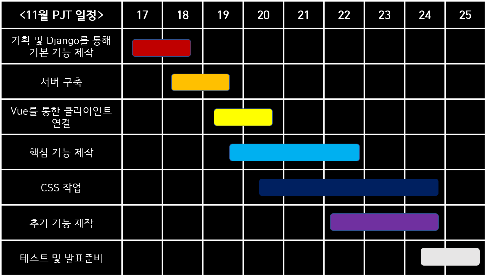
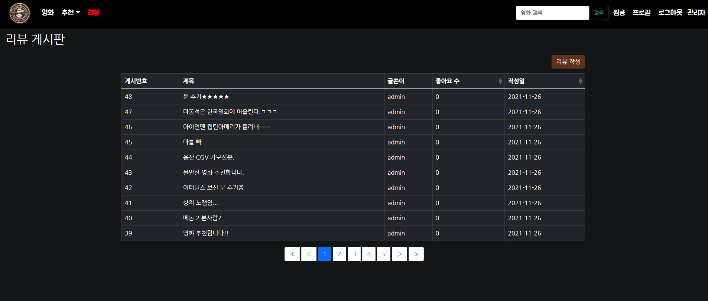

# Final_PJT_SSAfy  Been  

## 1. 팀 소개

(1) 팀원 정보

- 손영배
- 장효정

(2) 업무 분담

- 손영배

  - Django server & Vue Client

- 장효정

  - Vue Client & Design

  

## 2. 목표

- 영화 정보 기반 추천 서비스 구성
- 커뮤니티 서비스 구성
- HTML, CSS, JavaScript, Vue.js, Django, REST API, DataBase 등을 활용한 실제 서비스 설계
- 서비스 관리 및 유지보수

## 3. 계획

(1) 세부일정

(2) 기본 기능 구현

- [ ] 

(3) 추가 기능 목표

- [ ] 

(4) 개발환경

​	A . 언어

​		i. Python 3.8+

​		ii. Django 3.X

​		iii. Node LTS 

​		iv. Vue.js 2.+

​	B. 도구

​		i. vsCode

​		ii. Chrome Browser

​	C. 아키텍처

​		i. Django & Vanila JS

​		ii. Django REST API 서버 & Vue.js

## 4. ERD

## 5. 프로젝트 과정

#### (1) 2021. 11. 17

	1. ##### 오늘의 목표

- 영화데이터 API 수집할 곳 정하기, 조사하기 (같이)

- Wireframe 만들기 (효정)
- Django 기본 틀, Model 구축하기 (영배)
- Community, Movies 앱 CRUD 로직 작성 (영배)
- 프로젝트 세부 일정 수립하기 (같이)

2. ##### 오늘의 고민과정

- TMDB API를 통해 영화 데이터 크롤링하기
  - Front 단에서 axios 요청으로 데이터를 통신하는 것 이외에, 기본적으로 Server 내 DB에 일정량의 영화 데이터를 저장하고자 하였다.
  - TMDB API에서 영화 데이터를 불러오고, 이를 SSAfee Bean 프로젝트의 Movie 모델이 가지고 있는 속성과 일치하게끔 가져오려면 어떻게 해야할까? 라는 의문을 가지게 되었다.
  - 구글링을 통해서 `requests` 와 `json` , 그리고 기초적인 Python `for` 문을 사용하면 위 문제를 해결할 수 있음을 알게 되었고, 코드 작성을 통해 우리가 원하는 JSON 형태의 영화 데이터를 얻을 수 있었다.
- Community, Movies 앱의 CRUD 로직 작성
  - 프로젝트 명세에 따라 기본적이면서 핵심적인 CRUD 로직 작성을 하였다.
  - 프로젝트 기술 스택은 Django + Vue.js 이기 때문에 Django에 별도의 Templates 작성을 하지 않았다. 따라서 Django Rest Framework를 사용하여 직렬화(Serializer)된 데이터를 응답(Response)하는 구조로 각각의 CRUD 함수 코드를 작성하였다.
  - Community 앱의 Comment 관련 로직에 대한 고민이 남아있다.
    - 댓글 목록을 불러오는 path와 세부 댓글의 Read/Delete path가 분리되어 있다.
    - 어차피 하나의 리뷰에 여러개의 댓글이 달리는 구조인데, 이 path가 굳이 분리되어 있을 필요가 있을까? (효정과 논의 필요!)

3. ##### 오늘의 결과물

   - WireFrame

   

   

   - 기본 구조 생성

   .png)

   

   - TMDB API를 활용하여 DB에 저장할 영화 데이터 JSON 파일 생성

   

   

   - community & movies 앱 기본 CRUD 로직 작성
     - Postman을 사용하여 request가 정상적으로 작동하는지 확인

   

4. ##### 오늘의 느낀점

   - 장효정
     - 기획 단계가 가장 어렵고 중요하다고 하셨던 교수님 말씀이 이해가 완전 됐다. 기획내용들이 정확하면 개발하는 과정에서 헷갈리는 경우는 확실히 줄 것이라는 생각이 들었다.
     - wireframe을 처음 접하고 그려보면서 대략적인 완성본의 모습을 그린다는 게 생각했던 거보다 어려웠다. 그리는건 쉬운데 아이디어를 정리하고 어떻게 표현할 것인지 정리하는 과정에서 시간을 많이 사용했다.
     - 오늘 프로젝트 첫날인데 내일부터 끝나는 날까지 매일이 걱정보다는 기대가 크다. 물론 구현하려고 했던 게 생각처럼 바로 되지 않는 경우들 때문에 고민의 시간들이 있겠지만 그래도 생각했던 기능들을 다 구현해서 상상 속 페이지가 실제로 완성된 거 보면 엄청 뿌듯하고 기분 좋을 것 같다는 기대감이 든다.
   - 손영배
     - 프로젝트 1일차이다. 매주 금요일마다 했던 PJT 경험과 코드를 참고해서 기본적인 구조는 최대한 빠르게 작성하고자 하였다. 명세에 맞는 핵심 기능을 완벽하게 구현하고 나서 추가적으로 다양한 기능을 넣어볼 것이다.
     - 간단한 `.py` 파일을 만들어서 `requests` , `json` 을 활용한 TMDB API 영화 데이터를 크롤링 과정이 재미있었다. 사용자 정보 기반 영화 추천 알고리즘을 작성할 때에도 TMDB API 데이터를 활용할 수 있을 것 같다.

